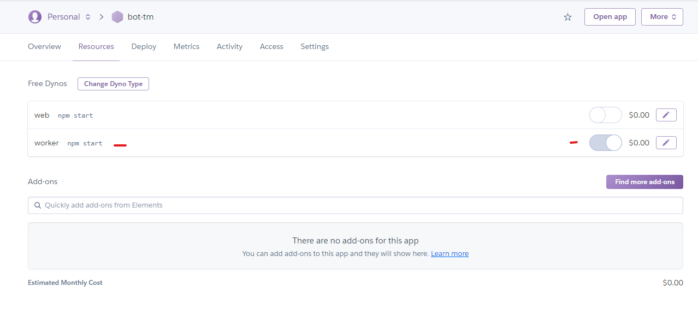

# Bot Discord Base - Nodejs + TS + HEROKU

Proyecto base de un Bot para un servidor de Discord con Nodejs + TypeScript.
Ya configurado para subir a un servicio de Heroku, para que este online siempre.

## Funciones:
- Mensaje de Bienvenida automaticamente cuando hay un miembro nuevo en el servidor, manda un mensaje diseñado en un canal especifico.
- Configuración del estado del Bot.
- Anti-Spam insertado por la libreria [discord-anti-spam](https://github.com/Michael-J-Scofield/discord-anti-spam).
- Mensajes Aleatorios cuando alguien escribe un "hola" por ejemplo.
- Configuración de "prefix" para ejecutar comandos. Por ejemplo con "!!".
- Comando para expulsar un mimbro con prefix.
- Comando para banear un miembro con prefix.

## En Producción (Heroku):
[HEROKU-WEB](https://dashboard.heroku.com/)
- Comentar la configuracion de .env en el archivo bot.ts.
- Configurar las variables en heroku en Settings(ajustes) del proyecto o con
heroku config:set DISCORD_TOKEN=AQUI VA EL TOKEN
- Configurar en Resources(Recursos), desactivar el recurso web y crear el worker
worker npm start y activar.
Con esto ultimo hace que el proyecto no se duerma despues de los 30minutos sin actividad.

## Screenshots

